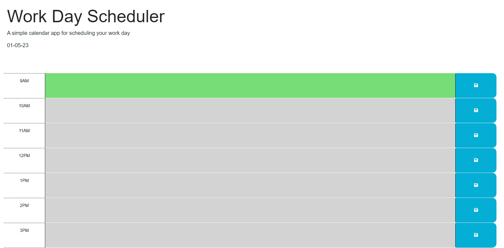

# Hokers-Day

## Description

A 9-5 Scheduler with color-changing text-box depending on the hour.

## Table of Contents

- [Installation] (#installation)
- [Usage] (#usage)
- [Credits] (#credits)
- [License] (#license)
- [Feature] (#feature)
- [Issue] (#issue)

# Installation

Open GitHub > Green "Code" Button" > Select SSH > Copy the link > Open a terminal > Type "git clone" + URL from GitHub > Let it install.

# Usage

# Credits

Assistance from previous assignments, Google (W3 and Mozilla), and my tutor Andrew. 

# License

MIT License

Copyright (c) 2022 JuicinessJ

Permission is hereby granted, free of charge, to any person obtaining a copy
of this software and associated documentation files (the "Software"), to deal
in the Software without restriction, including without limitation the rights
to use, copy, modify, merge, publish, distribute, sublicense, and/or sell
copies of the Software, and to permit persons to whom the Software is
furnished to do so, subject to the following conditions:

The above copyright notice and this permission notice shall be included in all
copies or substantial portions of the Software.

THE SOFTWARE IS PROVIDED "AS IS", WITHOUT WARRANTY OF ANY KIND, EXPRESS OR
IMPLIED, INCLUDING BUT NOT LIMITED TO THE WARRANTIES OF MERCHANTABILITY,
FITNESS FOR A PARTICULAR PURPOSE AND NONINFRINGEMENT. IN NO EVENT SHALL THE
AUTHORS OR COPYRIGHT HOLDERS BE LIABLE FOR ANY CLAIM, DAMAGES OR OTHER
LIABILITY, WHETHER IN AN ACTION OF CONTRACT, TORT OR OTHERWISE, ARISING FROM,
OUT OF OR IN CONNECTION WITH THE SOFTWARE OR THE USE OR OTHER DEALINGS IN THE
SOFTWARE.

# Feature

This is a 9-5 corporate scheduler. Which changes color depending on the hour and logs each text box.

# Issue

An issue that may happen would be 9AM is being recognized at future even though it should be past.